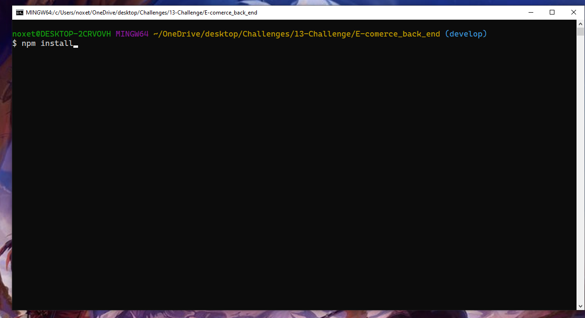

# E-commerce Back End Starter Code

## Description

A back-end application for keeping up with products in an E-commerce store.

## Usage

* Clone GitHub repository

* Open mysql environment

* Run the schema file by using "SOURCE db/schema.sql"

* Use "npm run seed" to add seeds to the Database

* Use "npm start" to start the server

* Use insomnia to make get, post, put, and delete requests

## Contributing

# Jonathan Faulkner
* Javascript
* Sequelize

## Links
[GitHub]https://github.com/JonnyFaulkner/E-commerce_back_end

[video]